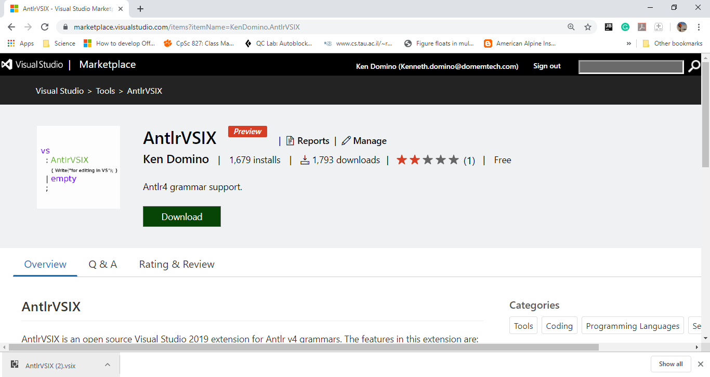
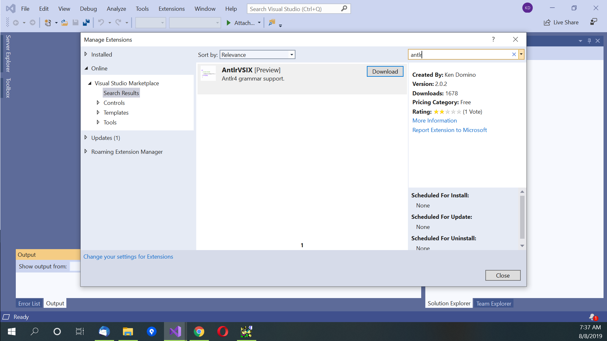

# Install AntlrVSIX in Visual Studio 2019

There are two ways to install AntlrVSIX in Visual Studio: (1) Download and install from a web browser; or, (2) Download and install
within Visual Studio IDE. In either case, I recommend that you verify the extension is installed
properly before proceeding.
 
## Download and Install from a Web Browser.

Go to the [Visual Studio Marketplace for Antlr](https://marketplace.visualstudio.com/items?itemName=KenDomino.AntlrVSIX).
Click on the "Download" button. When it finishes, click on the .vsix file, then click Install.

Step1: 

Step2: 

## Download and Install within Visual Studio IDE.

Open Visual Studio 2019, then click on "continue without code". Click on "Extensions -> Managed Extensions" in the menu bar.
Click "Online" and search for Antlr.
Click "Download". Close the Manage Extensions dialog box, and close Visual Studio 2019.
In the install program, click "Modify" and install for your the Visual Studio IDEs you have installed.

Step1: 

Step2: 

Step3: 

Step4: 

## Notes on Install

AntlrVSIX only targets VS2019. Older versions are no longer supported, albeit you could
build a version from sources targeting older versions of Visual Studio. An older version of AntlrVSIX
can be downloaded in lieu of building from sources.

## Verify Install

To verify that you have AntlrVSIX installed,
there should be a menu for AntlrVSIX under Extensions. (This menu is also available
when you right click in the grammar editor.)
Try opening an Antlr grammar (.g or .g4 suffix).
It should tag the grammar with colors (terminals orange, non-terminals purple,
etc).

## Building Antlrvsix

To build Antlrvsix, you will need to install Visual Studio 2019 with Net Core 3.1 and Framework 4.7.2.
I recommend that you build at a Developer Command Prompt for VS 2019. Simply type "msbuild /t:restore"
then "msbuild" from the top-level directory containing the sources. If you build within VS2019, it's
likely that you will need to build it twice. To build,
open Antlrvsix.sln and perform a build on a clean git fetch.
Then, close VS2019, and reopen it on Antlrvsix.sln again. You can now
"Build" to get the LSP server in the Antlrvsix.vsix file (it should be 31MB after building).

[Next: Basic editing of a grammar file](basic.md) 
