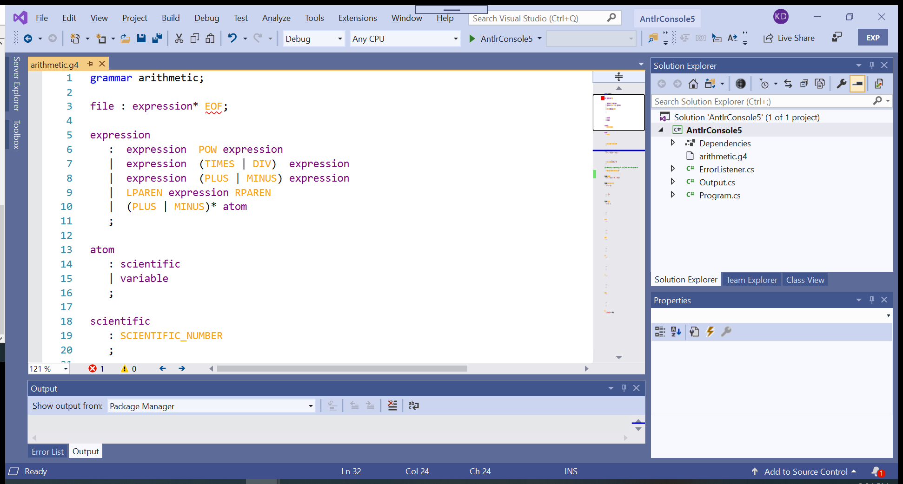
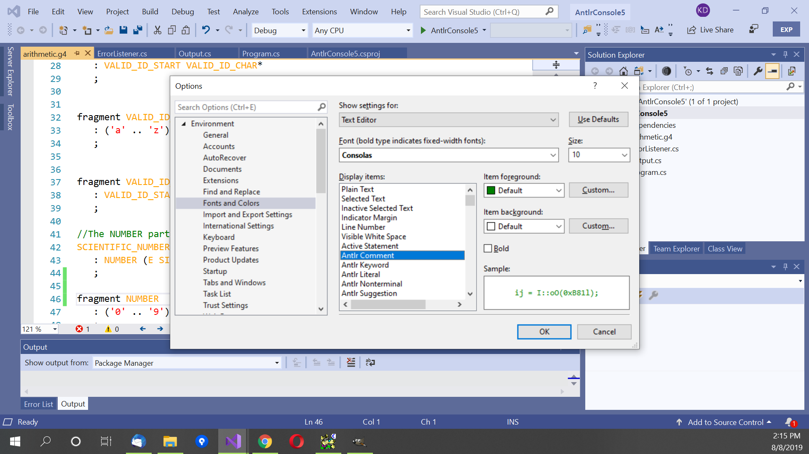

# Basic Editing of a Grammar

AntlrVSIX works with Antlr version 4 grammars. The extension recognizes Antlr4 grammars
with suffices .g or .g4. The extension will not recognize a grammar with any other suffix.
A grammar that is cannot be parsed will affect what features are available from the extension.
If the grammar is contained in multiple files in a project, the tool will keep track of symbols
across multiple grammar files.

## Tagging

AntlrVSIX tags all tokens in the grammar file. Keywords are colored blue; terminals are colored
orange; non-terminals are colored purple; literals are colored red; comments are colored green;
all punctuation are black.

In addition, AntlrVSIX also provides error squiggles under terminals and non-terminals that do not
have a defining rule in the file (or in the project). "EOF" is a built-in terminal provided by Antlr,
but there is no grammar rule that defines it.

To change the default color scheme, open "Tools -> Options" from the Visual Studio menu.
Select "Environment -> Fonts and Colors". Look for the "Antlr" items in "Display itmes", and
change the values to what you would like.

## Intellisense

Currently, AntlrVSIX provides only tool tips of the type of the symbol when you move the mouse over
it. You can, of course, gather the type of symbol by Antlr rules (all terminals begin with an uppercase
letter, non-terminals begin with a lowercase letter) or by the tag color.

## Go to Definition

