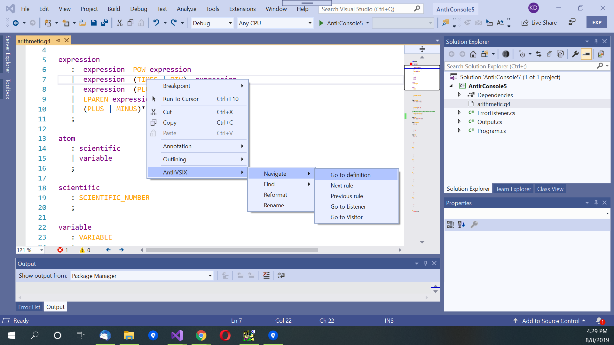
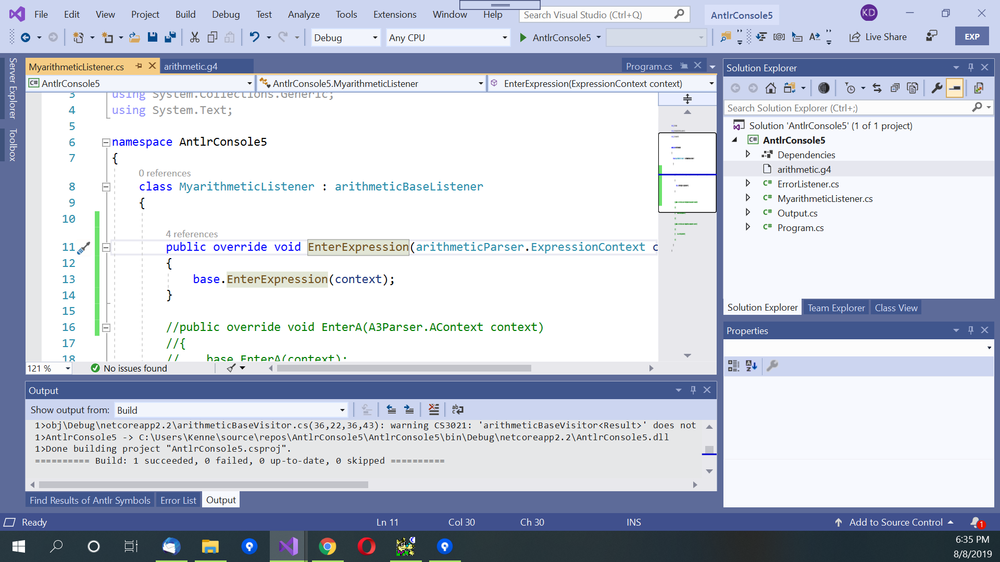

# Basic Editing of a Grammar

AntlrVSIX works with Antlr version 4 grammars. The extension recognizes Antlr4 grammars
with suffices .g or .g4, and will not recognize a grammar with any other suffix.
A grammar that cannot be parsed will affect what features are available from the extension.
Grammars can be split into multiple files, but they must be
added to a Visual Studio C# or C++ Project in order for the tool to keep track of
all grammar symbols.

AntlrVSIX is implemented using a Language Server Protocol API provided by Microsoft.

## Tagging

AntlrVSIX tags all tokens in the grammar file, but due to restrictions in the LSP API provided
by Microsoft, grammar symbols are not color coded. However, highlighting (by clicking on a symbol)
is supported.

## Intellisense Tooltip

AntlrVSIX provides tool tips of the type of the symbol when you move the mouse over
it. You can, of course, gather the type of symbol by Antlr rules (all terminals begin with an uppercase
letter, non-terminals begin with a lowercase letter).

## Intellisense Command Completion

AntlrVSIX provides some command completion suggestions. When the user types, the tool provides
a list of non-terminals and terminals currently in use in the grammar file. Note, it does not
yet suggest symbols of imported grammars unless they are already in use.

## Go to Definition

An easy but important way to navigate around the grammar is "go to definition" of a 
terminal or non-terminal. When a symbol is clicked on (at the beginning, end, or a character
within the symbol), the "go to definition" menu is enabled. (Note, right-clicking the symbol
will open a context menu containing AntlrVSIX, which you can use.)
Selecting "go to definition"
causes the caret and focus to be placed at the beginning of the rule for the symbol. AntlrVSIX
looks at all grammar files, selecting first the grammar file that is within the same directory
as the applied occurrence of the symbol. If AntlrVSIX does not find a defining rule for the symbol,
error squiggles will underscore the symbol, and the "go to definition" will not move the cursor.
You can use the "back arrow" button in the toolbar of VS to go back to the applied occurrence.

Right-click on symbol, select "go to definition":  

Result of "go to definition":  

Alternative menu selection via main menu of Visual Studio:  

## Find All References

AntlrVSIX has a "find all reference" operation. First, select the symbol
you are interested in. Note, only terminal or non-terminal symbols are searchable. If you are looking
for a particular string, use the general VS Find search tool.

Next, execute "find all references". Note, AntlrVSIX has a window Antlr symbol search results.
Click on "View -> Other Windows -> Antlr Find Results". In the "Find Results of Antlr Symbols" window,
click on a line to navigate to the line of the file containing the symbol.

Note, AntlrVSIX looks across multiple .g4 files contained in the Solution.

Right-click on symbol, select "find all references":  

Open up "Antlr Find Results":  

Dock the window, and select a line to navigate to the occurrence:  

## Go to Visitor/Listener

AntlrVSIX provides a way to navigate from a non-terminal symbol in the grammar to a visitor
or listener method for an IParseTree node of a parse tree corresponding to the symbol.
First, select the symbol
you are interested in. Then, right-click on the symbol, and select "AntlrVSIX
-> Navigate -> Go to listener" or "AntlrVSIX
-> Navigate -> Go to visitor". Note, by default, AntlrVSIX will not generate any method if it does not
find the method. Otherwise, you can change the settings for AntlrVSIX to do that in the Options for
the extension.

Note, there are two "listeners" per each symbol: Enter#symbol# and Exit#symbol#. By default,
AntlrVSIX navigates to the Enter#Symbol# method. If you want to navigate to the Exit#symbol# method,
press the Control-key while selecting "Go to listener". Note, for visitors, there is only one method.

Right-click on symbol, select "Go to listener":  

Result of navigation:  

[Next: Building and Running Antlr Applications](building.md) 
