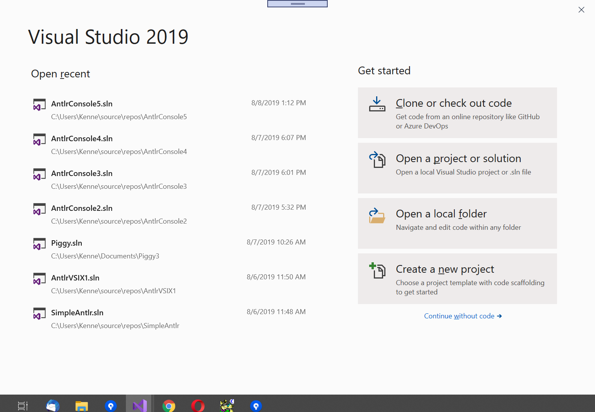

# Building and Running Antlr Applications

By default, there is no build support for Antlr grammars using AntlrVSIX. This was by design
because there were other Antlr extensions for Visual Studio which only performed basic tagging
and editor navigation. In order to eliminate conflicting Antlr extensions for tagging, the
build process was placed in a separate NuGet library.

This build tool, called [Antlr4BuildTasks](https://github.com/kaby76/Antlr4BuildTasks), is written in C#, and encapsulates
the Antlr command-line tool.
Antlr4BuildTasks is a standard package which you can [reference using NuGet](https://www.nuget.org/packages/Antlr4BuildTasks/).

## Prerequisites

* You must install the Java tool chain.
  [The Runtime Environment is sufficient](https://www.java.com/en/download/), but you may
  use instead the [Java Platform Standard Edition](https://www.oracle.com/technetwork/java/javase/downloads/index.html).
* You must [download the Java-based Antlr tool chain](https://www.antlr.org/download.html).
  You can probably use almost any version of Antlr, but this extension has only been tested with
  version 4.7.2, released December 18, 2018.
* You should set the environment variable _JAVA__HOME_ to the directory of the java installation.
  AntlrVSIX uses this variable to find _java.exe_. 
* You should set the environment variable _Antlr4ToolPath_ to the path of the downloaded Antlr jar file.
  When I download files via a web browser, the downloads go into the directory _c:\users\userid\Downloads\_.


## Adding Build Rules to an Existing Project

To add building capability to your Antlr program,
add a reference to Antlr4BuildTasks to the
library or application which contains the .g4 grammar files.
_NB: Do not include the generated .cs Antlr parser files
in the CSPROJ file for your program._ Instead, the generated
parser code is placed in the build temp output directory along with
the .obj files from the C# compiler.

If you prefer, you can add the paths of _JAVA__HOME_ and
_Antlr4ToolPath_ within the .CSPROJ file.

```
  <PropertyGroup Condition="'$(JAVA_HOME)'==''">
    <JAVA_HOME>C:\Program Files\Java\jdk-11.0.1</JAVA_HOME>
  </PropertyGroup>
  <PropertyGroup Condition="'$(Antlr4ToolPath)'==''">
    <Antlr4ToolPath>C:\Program Files\Java\javalib\antlr-4.7.2-complete.jar</Antlr4ToolPath>
  </PropertyGroup>
```

To build and run a program,
restore packages for the solution, then "F5".

## Multi-file grammars

AntlrVSIX and Antlr4BuildTasks handles multi-file grammars, e.g., a SomethingLexer.g4 and SomethingParser.g4. Simply add them
to your project, and make sure the Build Action under the File Properties dialog box is set
to "Antlr4".

If a grammar file imports another grammar file (via an import statement, e.g.,
"import LexBasic; // Standard set of fragments"),
make sure to set the Build Action under the File Properties dialog box to "None", not
"Antlr4". Otherwise, Antlr will be called for this imported file; Antlr should only be invoked
on the top-level grammar file.

## Creating an Antlr Application from the Project Templates

AntlrVSIX provides templates, available for NET Core or NET Framework,
which you can use to create a self-contained "Hello World!" Antlr application.

To create an Antlr application, open Visual Studio, then at the prompt, "Create a new project".
In the "Create a new project" dialog box, search for "Antlr" and select one of the two
templates AntlrVSIX provides. Configure the project, if you would like, then click on Create.
You should then be able to run and go: "F5". The program parses a simple expression, then outputs
a parenthesized-representation of the parse tree.

<br/>

<br/>

<br/>

<br/>

[Next: Customizing the keyboard](customizing.md)<br/>
