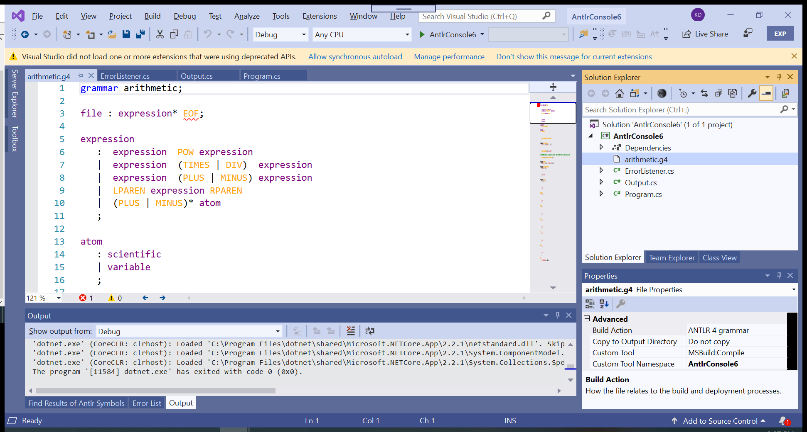

# Building and Running Antlr Applications

By default, there is no build support for Antlr grammars using AntlrVSIX. This was by design
because there were other Antlr extensions for Visual Studio which only performed basic tagging
and editor navigation. In order to eliminate conflicting Antlr extensions for tagging, the
build process was placed in a separate NuGet library.

This build tool, called [Antlr4BuildTasks](https://github.com/kaby76/Antlr4BuildTasks), is written in C#, and encapsulates the Antlr command-line tool which MSBuild can use.
Antlr4BuildTasks is a standard package which you can [reference using NuGet](https://www.nuget.org/packages/Antlr4BuildTasks/).

## Adding Build Rules to an Existing Project

To add building capability to your Antlr program, simply add a reference to Antlr4BuildTasks to the
library or application which contains the .g4 grammar files. Then, to build and run a program,
restore packages for the solution, then "F5".

AntlrVSIX provides a template, available in NET Core and NET Framework flavors,
which defines a self-contained application with a simple
grammar and parser.

__Important installation notes for Antlr4BuildTasks!__
* Installed Java tool chain.
* Downloaded the Java-based Antlr tool chain (a jar file).
* Set the environment variable JAVA_HOME to the directory of the java installation.
* Set the environment variable Antlr4BuildTasks to the path of the downloaded Antlr jar file.
* Do not include the generated .cs Antlr parser files in the CSPROJ file for your program. The generated parser code is placed in the build temp output directory and automatically included.
* Make sure you do not have a version skew between the Java Antlr tool and the runtime versions!!!!!

## Creating an Antlr Application from the Project Templates

To create an Antlr application, open Visual Studio, then at the prompt, "Create a new project".
In the "Create a new project" dialog box, search for "Antlr" and select one of the two
templates AntlrVSIX provides. Configure the project, if you would like, then click on Create.
You should then be able to run and go: "F5". The program parses a simple expression, then outputs
a parenthesized-representation of the parse tree.

 

 

 

 