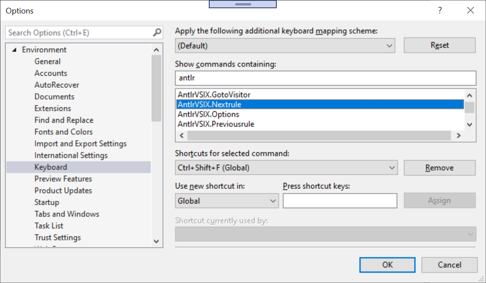

# Customizing the keyboard

Visual Studio offers a very useful way of binding key stokes to commands. As the menu
system for AntlrVSIX can be somewhat cumbersome to use, I highly recommend you
bind some of the commands.

Open from the main menu "Tools -> Options", then click on "Environment -> Keyboard" in the left-hand pane.
On the right-hand side, search for "antlr" in "Show commands containing:". Select the command
you would like to bind (e.g., AntlrVSIX.Nextrule or AntlrVSIX.Prevrule),
and enter a shortcut key (e.g., Cntl+Shift+F or Cntl+Shift+R).

 
