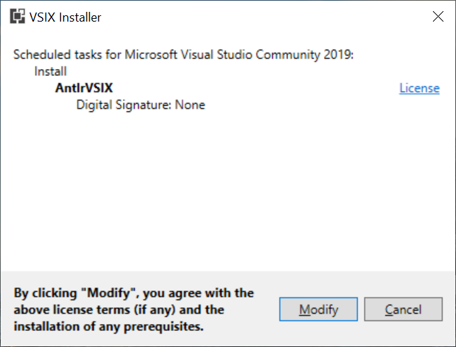

# Install AntlrVSIX in Visual Studio 2019

There are two ways to install AntlrVSIX in Visual Studio: (1) Download and install from a web browser; (2) Download and install
within Visual Studio IDE.
 
## Download and install from a web browser.

Go to the [Visual Studio Marketplace for Antlr](https://marketplace.visualstudio.com/items?itemName=KenDomino.AntlrVSIX).
Click on the "Download" button. When it finishes, click on the .vsix file, then click Install.

Step1: {width="75%"}

Step2: {width="75%"}

## Download and install within Visual Studio IDE.

Open Visual Studio 2019, then click on "continue without code". Click on "Extensions -> Managed Extensions" in the menu bar.
Click "Online" and search for Antlr.
Click "Download". Close the Manage Extensions dialog box, and close Visual Studio 2019.
In the install program, click "Modify" and install for your the Visual Studio IDEs you have installed.

Step1: {width="75%"}

Step2: {width="75%"}

Step3: {width="75%"}

Step4: {width="75%"}
